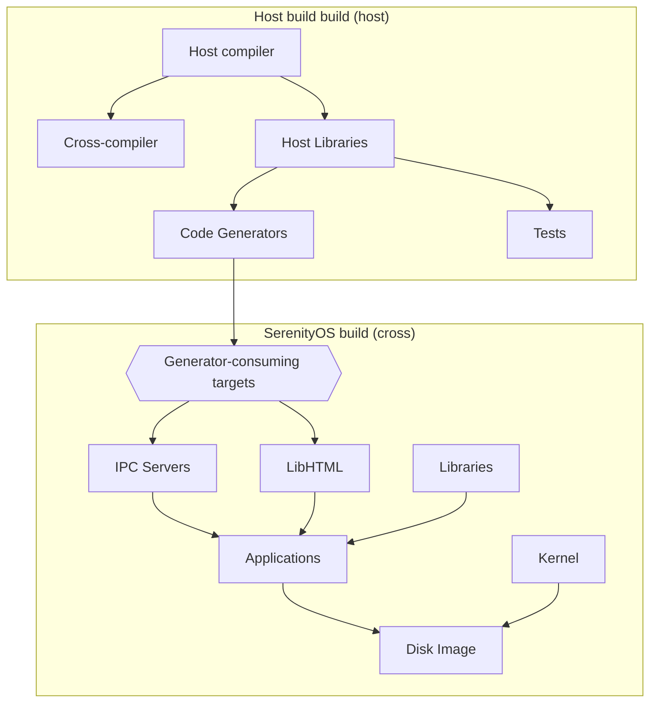

The build system for the [Serenity Operating System](https://github.com/SerenityOS/serenity) looks daunting at first glace. Let's take a look under the hood :^)

---

This series will go over the concepts, history, and rationale behind each phase of the Serenity operating system's build system design and implementation.

1. [Part 1: Makefile City](2022-5-28-SerenityOS-Superbuild-Makefiles.md)
1. Part 2: CMake Metropolis (this post)
1. Part 3: Superbuild Metro Area


In [the last part](2022-5-28-SerenityOS-Superbuild-Makefiles.md) we went over the state of the Serenity build system in mid-2019. The build system has
three main phases:

1. Create cross-compiler and sysroot
2. Build the Kernel and Userland
3. Install the root filesystem into the sysroot and create a disk image

As the project grew, the Makefile based build system starting showing its shortcomings. Build parallelism and dependencies between components was hard to model and keep right.
Often a small change would require a full rebuild due to missing dependencies, and the serial nature of the design made those full rebuilds painfully slow.

However, before we can talk about the transition to CMake, we need to introduce another concept: Host tools.

### Host tools: The complexity grows

In a [talk](https://www.youtube.com/watch?v=rHIkrotSwcc) at CppCon 2019, Chandler Carruth compared a hierarchy of abstractions in C++ code to an increasingly powerful set of hammers.
A function is a small hammer, types are a standard size hammer, templates are a sledgehammer, template and constexpr meta-programming are an even bigger sledgehammer, and so on. However, the
largest possible hammer is a python script used as a code generator that can generate all of the other levels of abstraction. In the SerenityOS build system, we reached the point where
code generators started looking like a better and better tool mid-2019. Using code generators is already difficult to understand for a normal project, but when you introduce
a requirement to cross-compile into the mix, code generators start to become a serious barrier to getting a complete picture of the build system.
We start needing more than one compiler in the mix during the build to create any of our libraries. When code generators start generating headers used by every file in a library or application,
they can also introduce some serious serialization bottlenecks in the build.

The first host tool added to the system was the [FormCompiler](https://github.com/SerenityOS/serenity/commit/2d3293dfbd085da013e65f3c001cc5be07a01eaa),
which generated LibGUI code from a json file ending with the ``.frm`` extension. This was used as part of the VisualBuilder application, which
was reminiscent of Visual Basic 5 and 6 from back in the day. However, the FormCompiler was eventually replaced with the GML compiler, and the VisualBuilder with the GMLPlayground. It turns out that
while Serenity picks a lot of design language and feel from the early 2000's Windows feel, graphical GUI designer applications belong in the past. Nobody actually used it to design Serenity applications,
and developer-minded contributors prefer editing code and other markup much more than messing about in a graphical GUI. If there were more frontend or graphic design contributors, maybe they could have
saved the application. Regardless, this host tool doesn't exist anymore, so let's take a look at the *second* host tool instead.

The second host tool Andreas added was a companion for LibIPC. The [IPCCompiler](https://github.com/SerenityOS/serenity/commit/aa8a3d4a8949da4a571194b85b480a371c3390ab) was added in early August 2019, and
first used to replace the custom LibAudio IPC protocol [later that day](https://github.com/SerenityOS/serenity/commit/8e684f095982597d548514ccd7f723f6f285b1f5). Interestingly, the use case is pretty similar
to that of Google's protobufs Chandler was describing in his talk: Generating code from a simplified description of an inter-process communication protocol. Rather than manually serializing data for each application
that wants to have a client-server relationship with a central daemon, LibIPC abstracts that away. A set of base classes are in LibIPC itself, while the details of each server's data model are described
in ``.ipc`` files that are generated into a server-specific set of Endpoint classes. While the details have changed significantly since the IPCCompiler was added, IPCCompiler is still critical to the
functionality of SerenityOS's many daemons and servers.

Both initial host tools manually included object files from the AK standard library and LibCore, which is clearly not ideal. Following this pattern, each new code generator needs to compile all of those
sources again and again. This problem doesn't get addressed until after the CMake transition, however.

The new build flow Andreas introduced with these code generators isn't particularly clear until [@jcs](https://serenityos.social/@jcs@social.sdf.org) refactored the build system in late 2019. The new top level Makefile as of [PR 889](https://github.com/SerenityOS/serenity/pull/889) demonstrates it pretty well.

```Makefile
# Build the host-side tools first, since they are needed to build some programs.
SUBDIRS = \
	DevTools/IPCCompiler \
	DevTools/FormCompiler \
	Libraries/LibHTML/CodeGenerators/Generate_CSS_PropertyID_cpp \
	Libraries/LibHTML/CodeGenerators/Generate_CSS_PropertyID_h

# Build LibC, LibCore, LibIPC and LibThread before IPC servers, since they depend on them.
SUBDIRS += \
	Libraries/LibC \
	Libraries/LibCore \
	Libraries/LibDraw \
	Libraries/LibIPC \
	Libraries/LibThread \
	Libraries/LibPthread

# Build IPC servers before their client code to ensure the IPC definitions are available.
SUBDIRS += \
	Servers/AudioServer \
	Servers/LookupServer \
	Servers/ProtocolServer \
	Libraries/LibAudio \
	Servers/WindowServer

SUBDIRS += \
	AK

SUBDIRS += \
	Libraries \
	Applications \
	DevTools \
	Servers \
	Shell \
	Userland \
	MenuApplets \
	Demos \
	Games \
	Kernel

include Makefile.subdir

.PHONY: test
test:
	$(QUIET) $(MAKE) -C AK/Tests clean all clean
```

Now, the build flow looks more like this:

0. Create cross-compiler toolchain
1. Build host tools
2. Build dependencies of IPC servers
3. Build IPC servers, which use host tools to generate header files
4. Build the rest of the system

However, the actual build requirements aren't this simple. For example, we don't need to build IPC servers before we start building the kernel. We also don't need to build any of the Libraries that don't
need any host tools after the host tools. A smarter build system could schedule those jobs in parallel. jcs alleviated some of the dependency tracking issues with the old build system with his changes, but the
parallelism story is still not great. A keen-eyed observer might also notice that the top level Makefile also has a ``test`` target, which builds tests for the AK library and executes them.
These days we have a lot more tests than just for AK built for the host :^).


### CMake and Build-level parallelism!

By early 2020, the build system was looking about as complex as a Makefile build system can while still being editable. Organized into blocks, the build phase looked something like the the diagram below.



Andreas's desire to increase build parallelism still left CMake as a natural solution, though. While we had better dependency tracking, the build was still very serialized in its implementation.
Starting at the end of 2019 and into early 2020, Andreas [prototyped](https://github.com/SerenityOS/serenity/commit/c03dea0a4fbb9261e0708b25a42d9d585c70f872) a conversion of the build to CMake.
We were already using CMake in some capacity for the [Ports](ports.serenityos.net) system, and the experimental [Lagom](https://github.com/SerenityOS/serenity/tree/d0c230855d4b9e656b51771c33d665e7c129f223/Meta/Lagom) 
sub-project was also initially written with a CMakeLists.txt at its core. Today Lagom is the core of the Ladybird Browser, as well as a significant amount of the continuous integration testing each
pull request goes through. Looking back on the build today, perhaps another meta-build system would have been better. CMake has some fundamental design decisions built-in that make creating a sane build 
system for a cross-compiled build awkward, to say the least, as we'll see shortly.

The progress towards a CMake build was tracked in [issue 2080](https://github.com/SerenityOS/serenity/issues/2080). After Andreas's initial experiment fizzled due to his inexperience with CMake, Sergey
picked it back up in May 2020. 

```
2020-03-28T17:08:21 #serenityos <pmr> kling: I just noticed the cmake_experiment branch. Did the experiment fail or did you just never finish?
...
2020-03-28T18:11:43 #serenityos <kling> pmr: i just never finished it
2020-03-28T18:12:18 #serenityos <kling> pmr: it looked pretty promising but i got stuck on some stupid little issues like generating a specific .o file in LibC before building everything else, and some other stuff
2020-03-28T18:13:02 #serenityos <kling> i'm not super strong with cmake so it was a bit frustrating
```

jcs seemed pretty thrilled at the prospect of the Makefile build system being replaced as well, as it was really showing its shortcomings by early May 2020 :^)

```
2020-05-05T18:19:04 #serenityos <solid_black> omg, the whole Userland links
2020-05-05T18:19:07 #serenityos <solid_black> this can't be real
2020-05-05T18:27:26 #serenityos <jcs> ?
2020-05-05T18:29:04 #serenityos <linusg> probably https://github.com/SerenityOS/serenity/issues/2080
2020-05-05T18:29:21 #serenityos <jcs> ah cool beans
2020-05-05T18:30:20 #serenityos <jcs> once it's switched to cmake i can stop feeling bad every time andreas gets frustrated at the build system in a video
2020-05-05T19:29:35 #serenityos <kling> jcs: lol it's still better than what we had before :)
2020-05-05T19:29:38 #serenityos <kling> jcs: so don't feel bad
```

The new build system was finally merged in [PR 2132](https://github.com/SerenityOS/serenity/pull/2132) to much fanfare. The fallout took a few followups to clean up, but by and large it was a positive improvement.
As Andreas explained to Jetbrains' Anastasia Kazakova in a [2021 interview](https://blog.jetbrains.com/clion/2021/11/talking-to-serenityos-contributors/), the transition made a huge impact on the parallelism and
overall build times for the project.

> With Makefiles, it was a constant battle to keep things building in the right order while spreading the compilation tasks across multiple cores. Moving to CMake was a big task, but one that has paid off greatly, both in terms of maintainability and build performance.

However, the avoidance of the host build problem kept causing issues as more and more complex build stages were added to the project. macOS users in particular kept running into build issues as we mixed
host and target builds in the same project.

### The host build problem

As part of the transition to CMake, Andreas and [solid_black](https://floss.social/@bugaevc) attempted to solve the "host build" problem. Looking at the mermaid diagram above, two things stand out:

1. There are two different "builds" that must be completed with two different compilers
2. Not all cross-compiled targets depend on the host build (other than the cross-compiler itself)

Even today, we split out the cross-compiler build into its own distinct first step, however. It's a lot simpler to obtain your toolchain completely separately from the actual software you're trying to compile,
as we'll see in more detail later.

One artifact of the Makefile build system as jcs left it was that choosing whether a subdirectory built with the host or target compiler was as simple as setting or not setting a ``USE_HOST_CXX`` variable
in each individual Makefile, as can be seen here:

https://github.com/SerenityOS/serenity/blob/d61131945d15e64cdf7ab0a2cbe584a915599428/Makefile.common#L25-L37

However, in CMake it's not quite that simple. A CMake build has two distinct phases: configuration, and build. Because CMake is a meta-build system and not a build system, it always generates the real
build system after the fact. On Unix-like operating systems, the preference is normally ninja first, then Makefiles. Makefiles are the default, however.

When generating a build system, CMake sets up the compiler, linker, and default flags for the configured [toolchain](https://cmake.org/cmake/help/latest/manual/cmake-toolchains.7.html). Each binary directory
of a CMake build can have exactly one configured Toolchain. What does this mean in practice? If you want to have an executable compiled and linked with one compiler, and an entire operating system compiled
and linked with a separate cross-compiler, **CMake does not support this in one binary directory**. You need more than one! One CMake binary directory for the host build, and another for the target build.
This was discussed extensively in [issue 4594](https://github.com/SerenityOS/serenity/issues/4594). Nevertheless, the initial transition plowed forward while ignoring this CMake design principle,
and made a bit of a mess in the process.

We'll cover how the host build problem was solved in part 3 :^).

---
